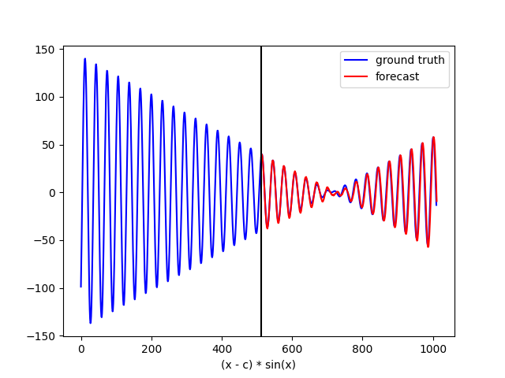
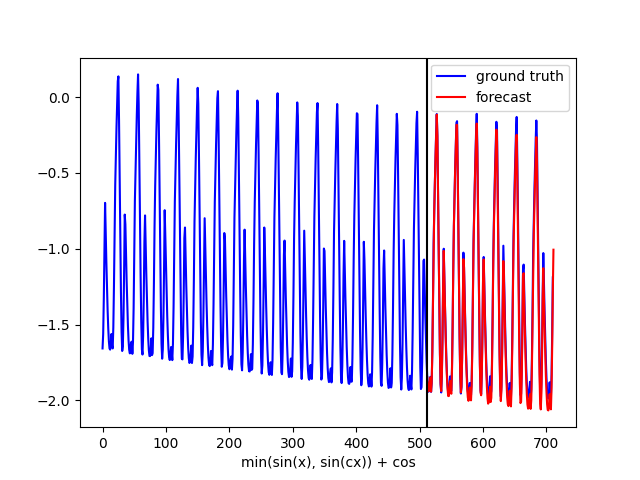
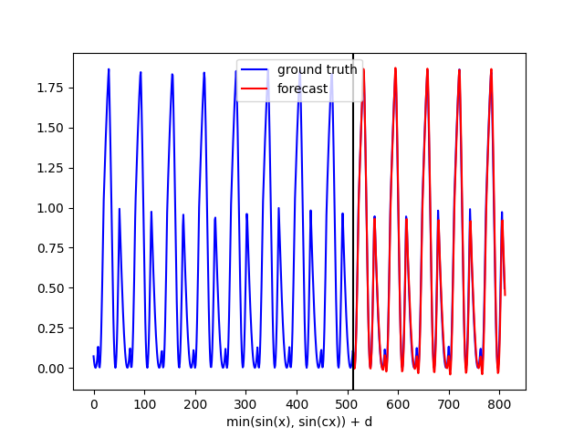
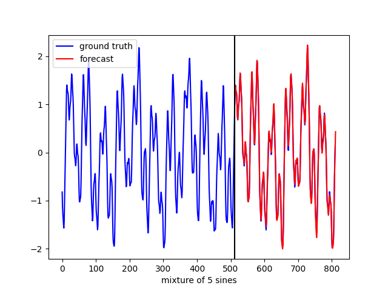

# Simple implementation of TimesFM
## Description
This code is **not official** TimesFM implementation.
TimesFM is a Transformer decoder-based forecasting model for time-series data, introduced in "[A decoder-only foundation model for time-series forecasting](https://arxiv.org/abs/2310.10688)".

The actual TimesFM model is trained on large time-series data and is designed to handle a variety of different time-series data in zero-shot.
However, this implementation is simply training with a few time-series data. And, although `output_patch_len` was set to `128` in the paper, for understandability, it is set to `32`, the same as `input_patch_len`.

No "probabilistic forecasting" is implemented. The output of the model is simply raw data, and concepts such as frequency are not implemented.

The main parts of this implementation are the prediction of patched time-series data used in TimesFM and the normalization of input data using Revin.

Revin, proposed in "[Reversible instance normalization for accurate time-series forecasting against distribution shift](https://openreview.net/forum?id=cGDAkQo1C0p)". It is a simple and useful method to deal with the distribution shift problem.

## Usage
### Training
Run `train.py`. This is a training with data from the 4 sine functions contained in the `datas` folder.

If you want to include other data, the csv file of 1D data with the column name 'Data' can be included to the training by placing it in the `datas` folder.

These are training on small data sets, and the Transformer decoder layer and head are very small models with 2 layers and 2 heads, respectively. If you want to change it, set TimesFMConfig in `timesfm.py`.

Note that there are no divisions for test data.

### Evaluation
To evaluate, execute the following commands:
```bash
python eval.py --data [DATA_PATH] --load_weights_folder [LOAD_WEIGHTS_FOLDER] --start_point [START_POINT] --forecast_len [FORECAST_LEN]
```
The `--data` option specifies the file path of the data to be forecasted.
The `--start_point` option specifies from which index to start forecasting; `--forecast_len` specifies how many forecasts to make ahead.
`--load_weights_folder` specifies the weights folder of the trained model.

## Result
With the forecast results for the four data, the model makes a forecast for the next patch_len using only the data before the black line. It then uses that prediction as input for the next prediction. Therefore, these forecasts do not include any ground truth values after the black line.

<table>
	<tbody>
		<tr>
			<td></td>
			<td></td>
		</tr>
		<tr>
			<td></td>
			<td></td>
		</tr>
	</tbody>
</table>

## References
Paper:
- TimesFM ([https://arxiv.org/abs/2310.10688](https://arxiv.org/abs/2310.10688))
- RevIN ([https://openreview.net/forum?id=cGDAkQo1C0p](https://openreview.net/forum?id=cGDAkQo1C0p))

Code:
- TimesFM ([https://github.com/google-research/timesfm](https://github.com/google-research/timesfm))
- RevIN (ICLR 2022) - Official PyTorch Implementation ([https://github.com/ts-kim/RevIN](https://github.com/ts-kim/RevIN))
- minGPT ([https://github.com/karpathy/minGPT](https://github.com/karpathy/minGPT))
